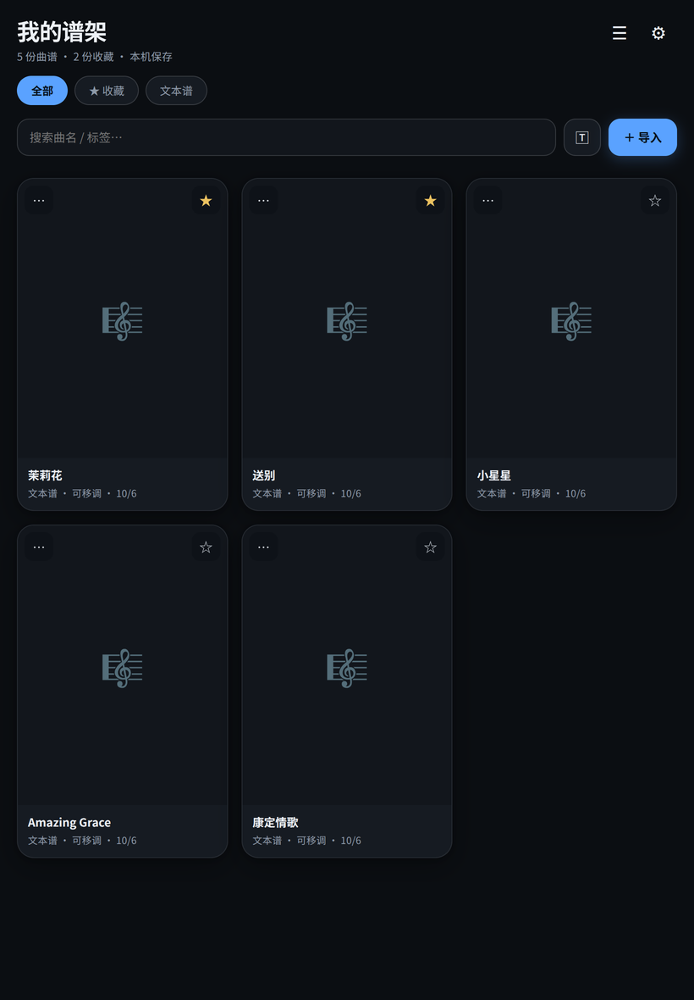
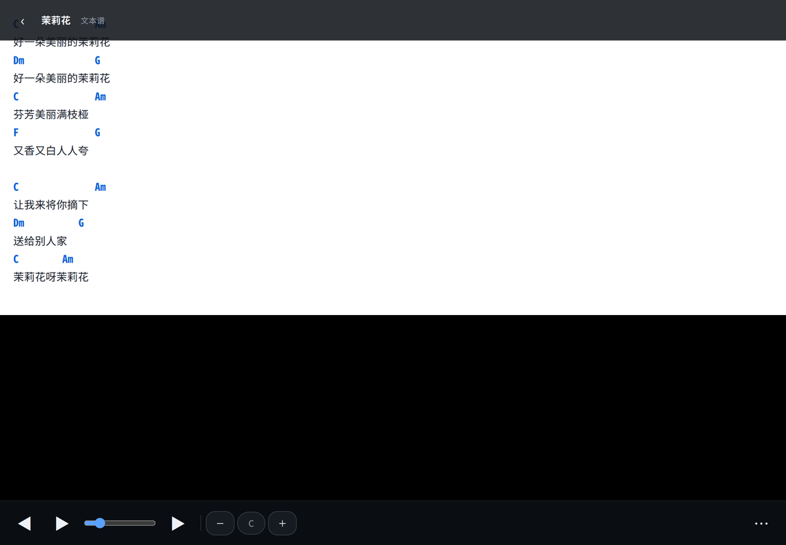

# 我的谱架 · My Stand

为平板弹唱看谱而做的**本地曲谱阅读器**（Web / PWA）。

曲谱全部保存在本机浏览器数据库中——不上传服务器、无账号、无广告、离线可用。

> 灵感来自对 Android 应用「有谱」(com.bandscore.band_score_reader) 运作模式的拆解，
> **代码与界面为全新原创实现**，二者无任何代码或资源关系。




---

## 为什么做这个

弹唱时需要的东西和普通乐谱 App 能给的不一样：

- **手上是什么谱就得看什么谱** —— 网上下的 PDF、拍的照片、自己敲的和弦文本，三种都有
- **舞台上不能低头找按钮** —— 需要翻页踏板、自动滚动、亮度/反色一键切换
- **现场可能没网** —— 曲谱必须在本地，而且要能在断网时启动
- **看谱时不想被 UI 挡住** —— 工具条要能整个藏起来

现有的开源方案基本只解决「和弦文本谱」这一类（ChordPro 系），
而且要先把谱转成它的格式才能用。这个项目把三种谱型放在同一个本地库里，
并且把「演出场景」当成一等公民来做。

---

## 设计（v2）

- **简约高级**：深色优先（舞台友好）+ 浅色主题，克制的单一强调色，大圆角卡片、柔和阴影、玻璃拟态工具条
- **流畅动效**：屏幕切换渐入、卡片错峰浮现、按压回弹、底部面板弹性上滑、开关平滑过渡；尊重系统「减弱动态效果」设置
- **好上手**：高频操作（翻页/自动滚动/移调）常驻看谱底栏，低频设置（模式/缩放/亮度/反色/常亮/节拍器/和弦）统一收进「⋯」底部面板；曲库支持「全部 / 收藏 / 文本谱」一键筛选

---

## 功能

- **曲谱库**：导入 PDF / 图片谱（多选），自动生成封面缩略图、页数统计；搜索、筛选、收藏、编辑信息（曲名/歌手/标签）、删除
- **三种曲谱类型**：
  - **PDF 谱**：按页渲染、缩放 50%~250%
  - **图片谱**：拍照/相册导入
  - **文本和弦谱**：直接粘贴和弦+歌词文本，自动识别并高亮和弦，**一键移调**（升降调即时换算，含斜杠低音和弦）、字号调节，可随时编辑内容
- **看谱器**三种翻页模式：
  - 滚动（连续视图）/ 单页 / 半页
  - 左右两侧点击翻页，中间点击唤出/隐藏工具条
  - 自动滚动（速度可调 10~300 像素/秒）
  - 键盘/蓝牙翻页踏板翻页（默认 → / ← / PageUp / PageDown，可在设置中捕获自定义按键）
  - 亮度调节、夜间反色模式、屏幕常亮（Wake Lock）
- **和弦速查面板**：31 个常用和弦指法图（开放和弦+横按），支持过滤搜索；打开文本谱时自动列出**本曲用到的和弦**
- **节拍器**：2/4、3/4、4/4、6/8，30~240 BPM，重音提示
- **曲单**：把演出曲目排成一串，看谱时 ⏮⏭ 快速切歌
- **备份**：一键导出/导入全部数据（JSON，含曲谱文件本体）
- **在线找谱**：设置页内置吉他社 / 彼岸吉他 / 弹琴吧 / Ultimate Guitar 快捷入口
- **PWA**：添加到主屏幕后全屏独立运行，Service Worker 缓存全部资源，**离线可用**

---

## 文本和弦谱的格式

这是最容易被忽略的一点：**和弦要单独成行、写在歌词上一行**，按空格/制表符对齐位置。
应用逐 token 判断是不是和弦，所以和弦和歌词混在同一行会被当成歌词原样显示。

```
C              Am
好一朵美丽的茉莉花
Dm             G
好一朵美丽的茉莉花
```

渲染结果：和弦行显示为蓝色加粗（并参与移调），歌词行按原样显示。

**识别规则**

| 支持的写法 | 例子 |
|---|---|
| 大三和弦 | `C` `D` `E` `F` `G` `A` `B` |
| 升降号 | `C#` `Db` `F#` `Bb` |
| 常见后缀 | `m` `7` `m7` `maj7` `sus` `add` `dim` `aug` … |
| 斜杠低音 | `C/G` `Am7/G` `D/F#` |

移调时按升号记谱（`C#`、`D#`…），暂不支持降号重拼。

---

## 运行

本机预览：

```bash
python3 server.py 8642
# 打开 http://localhost:8642
```

平板使用（同一 Wi-Fi 下）：

```bash
python3 server.py 8642
# 平板浏览器访问 http://<电脑局域网IP>:8642
# 浏览器菜单 → 添加到主屏幕 → 之后从桌面图标全屏使用
```

首次打开后资源即被缓存，之后离线也能使用（曲谱数据本就在本机）。

> `server.py` 只是带 `no-store` 头的静态文件服务器，改代码刷新即生效。
> 部署到任意静态托管（GitHub Pages / Vercel / Nginx）同样可用，
> 但 PWA 的 Service Worker 与 Wake Lock 需要 **https**（`localhost` 除外）。

---

## 目录结构

```
my-scores/
├── index.html              # 应用外壳（四个屏幕 + 和弦面板/文本工具条）
├── css/style.css           # 全部样式（深色/浅色主题）
├── js/
│   ├── db.js               # IndexedDB 封装（scores/setlists/kv）
│   ├── chords.js           # 和弦指法库、指法图绘制、解析/移调/高亮
│   ├── library.js          # 曲谱库、导入、文本谱、曲单、备份
│   ├── viewer.js           # 看谱器（渲染/翻页/自动滚动/和弦面板/常亮）
│   ├── metronome.js        # Web Audio 节拍器
│   ├── app.js              # 路由、全局设置、PWA 注册
│   └── vendor/             # pdf.js v3.11.174（Apache-2.0，本地内置）
├── icons/                  # 应用图标（脚本生成）
├── manifest.webmanifest    # PWA 清单
├── sw.js                   # Service Worker（网络优先，离线回落）
├── server.py               # 开发服务器（no-store 头，改代码即生效）
├── tools/make_test_pdf.py  # 生成空白测试谱 PDF
└── docs/screenshots/       # README 截图
```

**技术选择**：零框架、零构建步骤。四种屏幕加一个看谱器，状态不复杂，
引入框架的收益抵不过构建链的成本；用原生 JS 也让整个应用能被直接读懂和修改。
唯一的外部依赖是本地内置的 pdf.js。

---

## 已知边界（v2）

诚实列出来，因为它们都是有意做的取舍：

- 图片谱按单页处理；PDF 按页拆分渲染
- 文本谱移调使用升号记谱（C#、D#…），不支持降号重拼
- 和弦速查库暂收录 31 个常用和弦；识别规则覆盖常见后缀（m/7/m7/maj7/sus/add/斜杠低音等），个别罕见后缀不会被当作和弦
- iOS Safari 的 Wake Lock 需 https 环境；安卓平板局域网 http 下可用
- 数据存在浏览器 IndexedDB 里，**清空浏览器数据会丢失** —— 请定期用「备份」导出 JSON
- 没有多端同步（这是刻意的：本地优先，不上服务器）

---

## 以后想打包成真正的 APK

这套代码无需改动即可用 [Capacitor](https://capacitorjs.com) 包成安卓应用：

```bash
npm install @capacitor/core @capacitor/cli
npx cap init 我的谱架 com.example.mystand --web-dir=.
npx cap add android
npx cap open android   # Android Studio 里 Build APK
```

需要装 Node.js 和 Android Studio；不着急的话，PWA 加到主屏幕的体验已经和 App 基本一致。

---

## 第三方

| 组件 | 版本 | 许可 | 用途 |
|---|---|---|---|
| [pdf.js](https://github.com/mozilla/pdf.js) | 3.11.174 | Apache-2.0 | PDF 谱渲染（本地内置，非 CDN） |

详见 [THIRD-PARTY.md](THIRD-PARTY.md)。

---

## License

MIT — 见 [LICENSE](LICENSE)。
